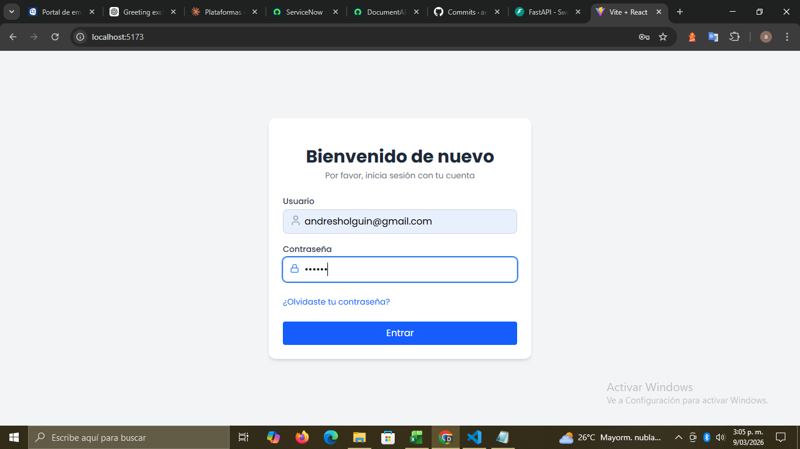
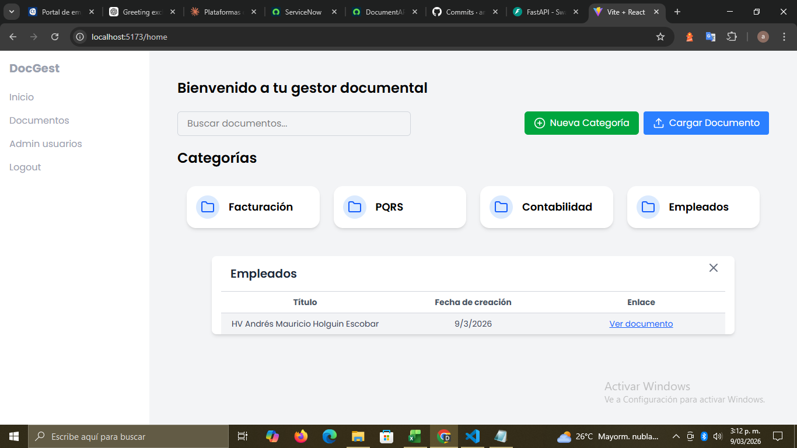
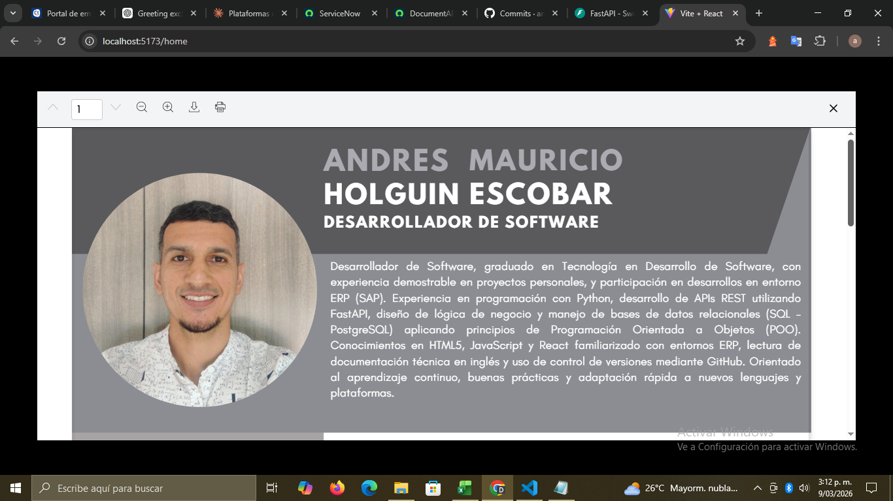

# 📄 Doc-Gest(Document Management System)


Sistema de gestión documental fullstack desarrollado como proyecto personal para profundizar en arquitecturas desacopladas y buenas prácticas de desarrollo.
Permite organizar, visualizar, descargar e imprimir documentos PDF desde una interfaz moderna, sin depender del visor nativo del navegador.

🛠️ Proyecto en desarrollo activo — actualmente se está implementando autenticación JWT y protección de endpoints.

Stack: FastAPI · React · Tailwind CSS · PostgreSQL · SQLAlchemy · Alembic

---

## 🚀 Características principales

- 📁 Organización de documentos por categorías
- 📄 Visualización de documentos PDF dentro de la aplicación
- ⬇️ Descarga directa de archivos
- 🖨️ Impresión desde el visor embebido
- 🎨 Interfaz moderna y responsiva
- 🔐 Backend desacoplado y preparado para escalabilidad
- 🗂️ Migraciones de base de datos versionadas

---

## 📸 Screenshots

### 🔐 Login


### 📁 Panel principal


### 📄 Visor PDF


## 🧱 Arquitectura del proyecto

El proyecto está dividido en dos capas principales:

frontend/   → Aplicación React
backend/    → API REST con FastAPI
⚙️ Backend – Tecnologías utilizadas
🐍 FastAPI
Framework principal para la construcción de la API REST.

Definición de endpoints REST

Validación automática de datos

Alto rendimiento y soporte asíncrono

Documentación automática (Swagger / OpenAPI)

🗄️ PostgreSQL
Base de datos relacional utilizada para el almacenamiento de la información.

Persistencia de categorías y documentos

Integridad referencial

Escalable y robusta para entornos productivos

🧬 SQLAlchemy
ORM utilizado para la interacción con la base de datos PostgreSQL.

Mapeo de tablas a modelos Python

Abstracción de consultas SQL

Manejo de sesiones y transacciones

🔁 Alembic
Herramienta de migraciones para SQLAlchemy.

Versionado del esquema de base de datos

Control de cambios estructurales

Sincronización entre entornos (dev / test / prod)

📦 Pydantic
Librería utilizada para la validación y serialización de datos.

Definición de esquemas (schemas)

Validación de datos de entrada y salida

Tipado fuerte y seguro

FastAPI utiliza Pydantic de forma nativa, pero es una librería independiente.

⚡ Uvicorn
Servidor ASGI para ejecutar la aplicación FastAPI.

Alto rendimiento

Soporte para aplicaciones asíncronas

Ideal para desarrollo y producción

🔐 Variables de entorno
Configuración del proyecto mediante variables de entorno (.env).

Credenciales de base de datos

Tokens y configuraciones sensibles

Separación de entornos (development / production)

🎨 Frontend – Tecnologías utilizadas
⚛️ React
Framework principal para la construcción de la interfaz de usuario.

Componentes reutilizables

Manejo de estado

Consumo de la API REST

🎨 Tailwind CSS
Framework de estilos utilitario para el diseño de la interfaz.

Diseño moderno y responsivo(se está trabajando la parte responsive para visualizarlo en diferentes resoluciones de pantalla)

Desarrollo rápido y consistente

Sin dependencias de componentes externos

📘 react-pdf-viewer
Visor de documentos PDF embebido en la aplicación.

Visualización de PDFs sin abrir pestañas externas

Descarga de documentos desde la aplicación

Impresión directa desde el visor

Soporte para documentos multipágina

Toolbar personalizable

🧪 Pruebas realizadas
Visualización de documentos PDF de una y múltiples páginas

Descarga correcta de documentos

Impresión desde el visor embebido

Manejo de estados de carga (spinner)

Pruebas con documentos de gran tamaño

Validación de rutas y permisos del backend

▶️ Ejecución del proyecto
Backend
```
# Crear y activar entorno virtual
python -m venv venv

# Windows
.\venv\Scripts\activate.bat

# Linux / Mac
source venv/bin/activate

# Instalar dependencias
pip install -r requirements.txt

# Ejecutar migraciones
alembic upgrade head

# Iniciar el servidor
uvicorn app.main:app --reload
```
Comandos para iniciar el Frontend
```
# Entrar a la carpeta del frontend
cd front-doc_gest

# Instalar dependencias
npm install

# Iniciar en modo desarrollo
npm run dev
```
📌 Notas técnicas
El visor PDF no depende del visor nativo del navegador

El backend sirve tanto metadata como archivos físicos

Arquitectura preparada para futuras extensiones:

Autenticación y roles

Control de permisos

Versionado de documentos

Almacenamiento en la nube

🧠 Autor
Desarrollado por Andrés Mauricio Holguín Escobar
Proyecto enfocado en buenas prácticas, arquitectura limpia y escalabilidad.

📄 Licencia
Este proyecto se distribuye bajo licencia MIT.
